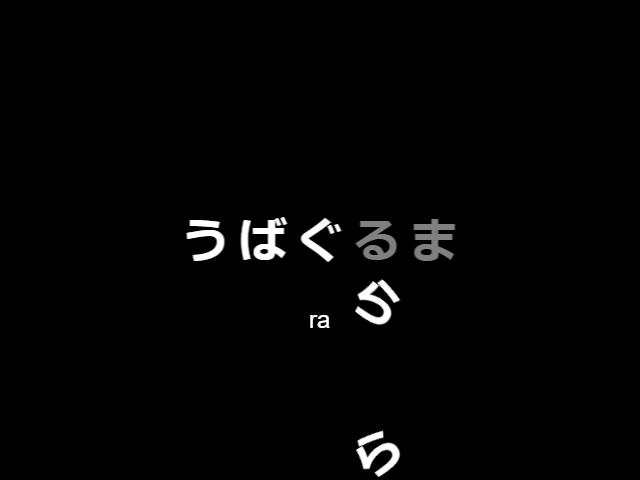
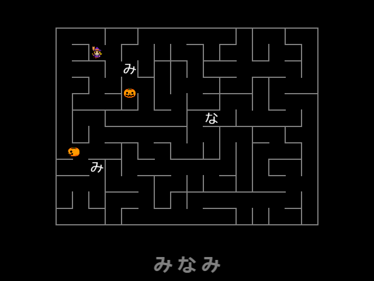
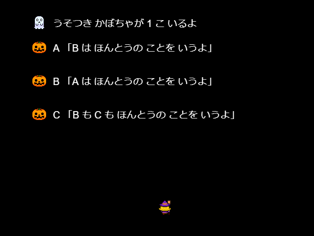

# kabocha-games
A collection of marginally educational mini games, targetting Japanese-as-a-minority-language multilingual kids (my son). https://kabocha-games.netlify.com/

## Games
### Typing Hiragana

### Maze

### Liar Pumpkins (Knights and Knaves puzzles)

